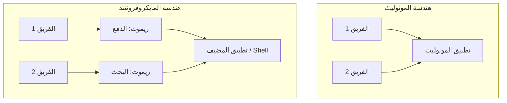
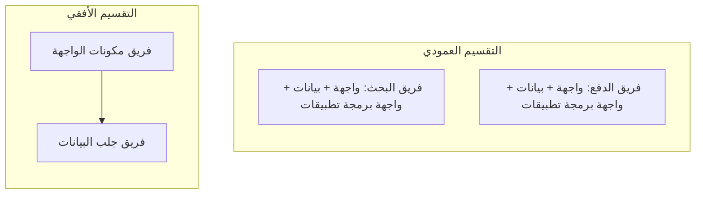
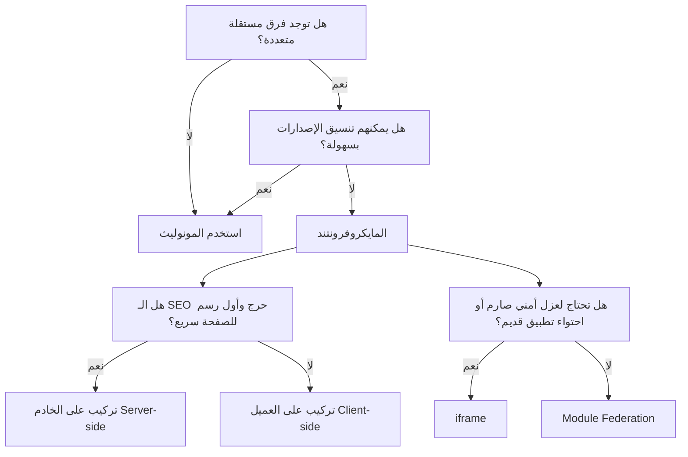

أسئلة المايكروفرونتند تظهر أكثر فأكثر في جولات تصميم أنظمة الواجهة الأمامية لمستوى senior وstaff. الفخّ هو التعامل مع المصطلح كأنه فكرة واحدة. في الحقيقة هو مجموعة قرارات منفصلة: كيف تملك الفرق الميزات، كيف يُنشَر الكود، أين تُركَّب الصفحة، كيف تُدار الاعتماديات المشتركة، وكم عزلًا يحتاج كل جزء. إن استطعت فصل هذه القرارات، ستبدو كشخصٍ رأى الكلفة التشغيلية، لا شخصٍ يردّد الرسم المعماري فقط.

> النموذج الذهني: **مونوليث الواجهة الأمامية** هو تطبيق واحد قابل للنشر، تملكه الفرق وتشحنه كوحدة واحدة. أما **المايكروفرونتند** فيقسّم المنتج إلى قطع واجهة أمامية مستقلة الملكية، تستطيع فرق مختلفة بناءها واختبارها ونشرها، وأحيانًا التراجع عنها، بشكل منفصل. الصعوبة ليست "استخدام Module Federation". الصعوبة هي تحديد أين تستحق الاستقلالية كلفة وقت التشغيل، والأدوات، ونظام التصميم، والحوكمة.

## مقارنة سريعة

قبل الغوص في التفاصيل، إليك ملخصًا عالي المستوى للبنيتين:

| الميزة | مونوليث الواجهة الأمامية | المايكروفرونتند |
| :--- | :--- | :--- |
| **النشر (Deployment)** | بناء ونشر واحد | نشر مستقل لكل فريق |
| **قاعدة الكود (Codebase)** | مستودع واحد (عادةً) | مستودعات متعددة أو monorepo كبير |
| **حزمة التقنيات (Tech Stack)** | موحدة ومتسقة | يمكن أن تكون مختلطة (لكن لا يُنصح بها للأداء) |
| **تنسيق الفرق** | عالٍ (إصدارات تعطل بعضها) | منخفض (إصدارات مستقلة) |
| **التعقيد** | منخفض في البداية، وينمو مع التوسع | عالٍ في البداية (أدوات، توجيه، حالة) |

## الفرق الأساسي

ابدأ بوحدة النشر.



| النموذج | ما الذي يُشحَن؟ | متى يناسب؟ |
|---|---|---|
| **مونوليث الواجهة الأمامية** | تطبيق واحد، بناء واحد، خط نشر واحد | فريق واحد أو فرق قليلة متناسقة جدًا، إيقاع إصدار مشترك، واتساق UX قوي |
| **مايكروفرونتند** | قطع واجهة أمامية متعددة قابلة للنشر مستقلًا | فرق كثيرة، خرائط طريق منفصلة، حدود ملكية واضحة، وحاجة للشحن دون تنسيق كل إصدار |

المونوليث ليس سيئًا تلقائيًا. لمعظم المنتجات، هو نقطة البداية الصحيحة لأنه يبقي النظام بسيطًا: موجّه واحد، رسم اعتماديات واحد، نسخة واحدة من نظام التصميم، إعداد اختبار واحد، سطح مراقبة واحد، وإصدار واحد. تدفع كلفة تنسيق أقل داخل الكود لأن الجميع يعمل في التطبيق نفسه.

المايكروفرونتند تشتري استقلالية الفرق. يستطيع فريق الدفع نشر checkout دون انتظار البحث. يستطيع فريق الفوترة امتلاك الفوترة من البداية للنهاية. ويمكن تركيب صفحة marketplace من أسطح مستقلة: المنتج، والتوصيات، والمراجعات. المقايضة أن البنية الآن يجب أن تحل مشكلات كان المونوليث يمنحها مجانًا: الاعتماديات المشتركة، التوجيه بين التطبيقات، اتساق التنسيق، سياق المصادقة، المراقبة، توافق الإصدارات، ميزانيات الأداء، وعزل الفشل.

إجابة senior ليست "المايكروفرونتند تتوسع أفضل". بل: **المايكروفرونتند توسّع ملكية الفرق، لكنها تُدخل مشكلات الأنظمة الموزعة إلى الواجهة الأمامية.**

## التقسيم العمودي مقابل الأفقي

هذا قرار الملكية. وهو منفصل عن التقنية.

### التقسيم العمودي

**التقسيم العمودي** يعطي فريقًا واحدًا شريحة ميزة كاملة من البداية للنهاية: الواجهة، والحالة، وجلب البيانات، وعقد API، والاختبارات، والمراقبة، والإصدار. مثلًا:

- البحث يملك صفحة البحث، والمرشحات، وقائمة النتائج، وعقد Search API.
- الدفع يملك مراجعة السلة، وخطوة الدفع، والتحقق من العنوان، وتحليلات checkout.
- الحساب يملك الملف الشخصي، والإعدادات، والجلسات، وتفضيلات الأمان.

غالبًا هذا هو الحد الصحي للمايكروفرونتند لأنه يطابق ملكية المنتج. يستطيع الفريق التفكير في رحلة المستخدم وتغييرها دون طلب تحديث "طبقة الصفحة المشتركة" من فريق آخر.

### التقسيم الأفقي

**التقسيم الأفقي** يقسم حسب الطبقة التقنية أو طبقة الصفحة: فريق يملك الترويسة، وآخر يملك البطاقات، وآخر يملك الوصول للبيانات، وآخر يملك التخطيطات. قد يبدو نظيفًا في الرسم، لكنه غالبًا يصنع سلاسل اعتماد لكل تغيير منتجي. قصة مستخدم بسيطة تعبر عدة فرق.



قد يكون التملك الأفقي منطقيًا لفرق المنصة: نظام التصميم، والـ shell، ومنصة التوجيه، وSDK المراقبة، وإطار التجارب، أو طبقة المصادقة المشتركة. لكن في ميزات المنتج، غالبًا يبطئ التسليم لأن لا فريق يملك النتيجة كاملة.

> صياغة المقابلة: "سأفضل التقسيم العمودي حول قدرات العمل، مع طبقة منصة صغيرة للبنية المشتركة فعلًا. التقسيم الأفقي مفيد لبدائيات المنصة، لكنه خطر لملكية المنتج لأن كل ميزة تصبح تنسيقًا بين فرق."

## التركيب على العميل مقابل الخادم

التركيب يجيب عن السؤال: **أين تُخاط القطع لتصبح صفحة واحدة؟**

### التركيب على العميل

في التركيب على العميل، يحمّل المتصفح تطبيقًا مضيفًا أولًا، ثم يسحب المضيف قطعًا remote وقت التشغيل. هذا شائع في بنى شبيهة بـ Module Federation.

الميزة هي المرونة وقت التشغيل. تستطيع الفرق نشر remotes مستقلًا، ويستطيع المضيف تحديد أي remote يحمّله حسب المسار، أو المستخدم، أو التجربة، أو feature flag. يناسب أيضًا الأسطح التفاعلية الشبيهة بالتطبيقات حيث SEO أقل أهمية.

الكلفة هي أداء التحميل الأول. قد يحتاج المتصفح إلى تحميل الـ shell، ثم حل manifests للـ remotes، ثم جلب حزم remote، ثم تهيئة الاعتماديات المشتركة، ثم عرض الصفحة الحقيقية. إن لم تكن صارمًا في ميزانيات الحزم وحالات fallback، فقد تحوّل تطبيقًا واحدًا إلى سلسلة انتظار من تطبيقات.

### التركيب على الخادم

في التركيب على الخادم، تخيط طبقة الخادم أو edge الصفحة قبل وصولها إلى المتصفح. يحصل المستخدم على HTML مركّب أبكر، وهذا يعني عادةً first paint أسرع وSEO أفضل. يناسب هذا النموذج الأسطح العامة أو الغنية بالمحتوى أو التجارة الإلكترونية حيث أول شاشة مهمة.

تنتقل الكلفة إلى البنية التحتية. تحتاج طبقة تركيب تستطيع استدعاء أو عرض كل fragment، والتعامل مع timeouts، والتخزين العدواني، وعزل الفشل، والحفاظ على سياق الطلب المتسق. التركيب على الخادم ليس مجانيًا؛ إنه ينقل التعقيد من المتصفح إلى المنصة.

| الخيار | القوة | انتبه إلى |
|---|---|---|
| **التركيب على العميل** | تحميل مستقل وقت التشغيل، مرن للواجهات الشبيهة بالتطبيقات | شلالات الحزم، تأخر first paint، حدود SEO |
| **التركيب على الخادم** | محتوى أول أسرع، SEO أفضل، shell قابل للتخزين | تعقيد منصة أكبر، timeouts للـ fragments، تنسيق الطلبات |

في تصميم أنظمة senior، اربط هذا بالمنتج مباشرة. لوحة تحكم داخلية خلف تسجيل دخول قد تتحمل التركيب على العميل. صفحة تفاصيل منتج عامة غالبًا تحتاج تركيبًا على الخادم، أو توليدًا ساكنًا، أو على الأقل shell معروضًا من الخادم.

## المضيف مقابل الريموت

في إعداد مايكروفرونتند، **المضيف** هو تطبيق الـ shell الذي ينسّق الصفحة. عادةً يملك:

- التوجيه والتنقل على أعلى مستوى
- سياق المصادقة والجلسة
- مناطق التخطيط
- تهيئة feature flags
- حدود التحميل والخطأ
- إعداد الاعتماديات المشتركة
- خطافات المراقبة العامة

أما **الريموت** فهو قطعة مستقلة البناء والنشر يسحبها المضيف. قد يكون الريموت مسارًا كاملًا، أو منطقة في الصفحة، أو widget. يجب أن يملك واجهته الداخلية، واختباراته، وجلب بياناته، وعملية إصداره.

يجب أن يكون الحد صريحًا. إن وصل المضيف عميقًا إلى تفاصيل الريموت، أو اعتمد الريموت على حالة غير موثقة داخل المضيف، تصبح البنية مونوليثًا موزعًا: قابلية نشر متعددة، لكن بلا استقلالية حقيقية.

قد يبدو عقد نظيف هكذا:

```tsx
type ProductReviewsRemoteProps = {
  productId: string;
  locale: string;
  user?: {
    id: string;
    isLoggedIn: boolean;
  };
  onReviewSubmitted?: (reviewId: string) => void;
};
```

هذا العقد صغير، ومكتوب TypeScript، وموجّه للمنتج. لا يكشف store المضيف، ولا تفاصيل router، ولا افتراضات التنسيق. يستطيع الريموت التطور خلفه.

## Module Federation مقابل iframe

هذا قرار العزل. كلاهما يمكن أن يشغّل مايكروفرونتند، لكنهما يحلان مشكلتين مختلفتين.

### Module Federation

يسمح Module Federation للمضيف بتحميل وحدات JavaScript من بناء آخر وقت التشغيل. يعمل الريموت داخل DOM وسياق JavaScript نفسيهما للمضيف. هذا يعني أنه يمكن أن يبدو أصليًا: توجيه مشترك، ونظام تصميم مشترك، واعتماديات مشتركة، وتركيب مكوّنات React طبيعي، ودون حد iframe.

المقايضة هي عزل أضعف. قد تتسرب CSS. قد تتعارض نسخ الاعتماديات. قد يؤثر remote على أداء main thread للصفحة كلها. وقد يكسر خطأ runtime أكثر من منطقته إن لم تغلّفه بحدود خطأ. والحالة المشتركة قد تبدو مغرية ثم تصبح خطرة.

استخدم Module Federation حين يحتاج المنتج تجربة تطبيق واحدة متماسكة، وتستطيع الفرق الاتفاق على عقود المنصة: نسخة React، ونظام التصميم، واتفاقيات التوجيه، والتحليلات، وقواعد سهولة الوصول، وميزانيات الأداء.

### iframe

يعطي iframe عزلًا قويًا. الريموت لديه document خاص، وCSS خاص، وruntime JavaScript خاص، ورسم اعتماديات خاص، وsandbox أمني. لا يستطيع تسريب الأنماط إلى المضيف بالخطأ. هذا مفيد للتضمينات الخارجية، أو الكود غير الموثوق، أو التطبيقات القديمة، أو widgets الدفع، أو أدوات admin، أو المناطق ذات متطلبات عزل صارمة.

الكلفة هي احتكاك التكامل. الحالة المشتركة ليست طبيعية؛ التواصل يمر عبر `postMessage`. التنسيق والتخطيط المتجاوب أصعب. سهولة الوصول وإدارة التركيز تحتاج عناية إضافية. التوجيه والتحليلات والمصادقة غالبًا تحتاج جسورًا. وقد تبدو الواجهة أقل اندماجًا.

| الخيار | الأفضل لـ | الكلفة الرئيسية |
|---|---|---|
| **Module Federation** | فرق first-party تبني منتجًا واحدًا متماسكًا | اقتران runtime وحوكمة الاعتماديات المشتركة |
| **iframe** | عزل قوي، أسطح خارجية أو قديمة، حدود أمنية | حالة وتنسيق وتوجيه وسهولة وصول وUX أصعب |

الإجابة الواثقة ليست "iframes قديمة" أو "Module Federation حديث". الإجابة هي: **Module Federation يحسّن التكامل؛ iframe يحسّن العزل.**

## ما الذي قد يفشل؟

تفشل المايكروفرونتند حين تقسّم الفرق الكود لكنها تبقي اقترانًا مخفيًا.

### الاعتماديات المشتركة تصبح عنق زجاجة للإصدار

إن كان كل remote يجب أن يتحدث معًا عند تغيير React أو نظام التصميم أو analytics SDK، فأنت لم تربح استقلالية كبيرة. عرّف ما الاعتماديات المشتركة، ومن يملكها، وما النسخ المسموحة، وكيف تُطرَح الترقيات.

### التنسيق يفقد الاتساق

قد تصنع الفرق المستقلة خمسة أشكال للأزرار، وأربعة أنظمة مسافات، وحالات تحميل غير متسقة. إعداد مايكروفرونتند ناضج يحتاج نظام تصميم بتوكنز، ومكوّنات سهلة الوصول، وإصدارات، وقواعد مساهمة واضحة.

### الأداء يصبح مسؤولية الجميع ولا أحد

كل remote قد يكون "80 KB فقط"، لكن الصفحة المركبة الآن تحمّل ستة منها. ضع ميزانيات على مستوى الصفحة، لا الفريق فقط: JavaScript المشحون، وLCP على مستوى المسار، وINP، وCLS، وعدد طلبات الشبكة، وسلوك timeout عند تحميل الريموت.

### عزل الفشل غير موجود

إن فشل remote التوصيات، يجب أن تبقى صفحة المنتج قابلة للعرض. غلّف remotes بحدود تحميل وخطأ وtimeout. قرّر fallback المقبول: إخفاء القسم، إظهار skeleton، إظهار بيانات مخزنة، أو عرض مكوّن محلي منخفض الجودة.

```tsx
<RemoteBoundary
  name="reviews"
  fallback={<ReviewsSkeleton />}
  errorFallback={<ReviewsUnavailable />}
  timeoutMs={2500}
>
  <ProductReviews productId={product.id} locale={locale} />
</RemoteBoundary>
```

هذا النوع من الحدود ليس زينة. إنه الفرق بين نشر مستقل وبين remote واحد يُسقط الصفحة.

### المراقبة تتوقف عند الـ shell

تحتاج أن تعرف أي remote سبب الخطأ، وكم استغرق تحميله، وأي نسخة كانت فعالة، وهل النشر السيئ يؤثر على مسار واحد أم التطبيق كله. يجب أن تتضمن السجلات والمقاييس والتتبعات وتقارير أخطاء الواجهة: اسم الريموت، ونسخته، والمسار، وشريحة المستخدم، وحالة feature flag.

## أمثلة من العالم الحقيقي

لربط النظرية بالواقع، فكّر في كيف تتعامل المؤسسات الكبيرة مع هذا:

- **التجارة الإلكترونية (مثل IKEA، Amazon):** تستخدم المايكروفرونتند بكثافة. يمكن لفريق البحث، وفريق تفاصيل المنتج، وفريق الدفع (checkout) النشر بشكل مستقل. وجود خطأ في ريموت توصيات المنتجات لن يمنع المستخدم من إكمال عملية الدفع.
- **بث الصوت (مثل تاريخ تطبيق Spotify لسطح المكتب):** استخدموا المايكروفرونتند في البداية عبر iframes (وبعدها تقنيات أخرى) للسماح لفرق منفصلة بامتلاك المشغّل، وقائمة التشغيل، والبحث، مما يضمن سرعة التكرار في الميزات دون كسر مشغل الصوت الأساسي.
- **لوحة تحكم SaaS (مثل أداة تحليلات B2B بسيطة):** عادةً ما تبقى كمونوليث. يبنيها فريق صغير، ويتوقع المستخدم تجربة تطبيق صفحة واحدة (SPA) متماسكة وسريعة بدون شلالات تحميل (waterfalls).

## كيف تجيب في مقابلة تصميم نظام

عند سؤال "هل ستستخدم microfrontends؟"، لا تجب بأداة. امشِ القرار.

### شجرة قرارات المايكروفرونتند



1. **وضّح المنظمة.** كم فريقًا يعمل على هذه الواجهة؟ هل يحتاجون إيقاعات إصدار منفصلة؟ هل حدود الملكية مستقرة؟
2. **وضّح سطح المنتج.** هل هو عام وحساس لـ SEO، أم تطبيق موثّق؟ هل first paint حرج؟ هل توجد أسطح legacy أو third-party؟
3. **اختر التقسيم.** فضّل حدودًا عمودية حول قدرات العمل. أبقِ ملكية المنصة الأفقية محدودة وصريحة.
4. **اختر التركيب.** استخدم تركيبًا على الخادم أو shell معروضًا من الخادم حين يهم first paint وSEO؛ واستخدم التركيب على العميل لتدفقات authenticated الشبيهة بالتطبيقات حين تهم مرونة runtime أكثر.
5. **اختر العزل.** استخدم Module Federation لتجارب first-party متماسكة؛ واستخدم iframe حين يكون العزل أو الأمان أو احتواء legacy أهم من التكامل السلس.
6. **اذكر عقود المنصة.** نظام التصميم، الاعتماديات المشتركة، التوجيه، المصادقة، التحليلات، حدود الخطأ، الإصدارات، الاختبار، والتراجع.
7. **اذكر المقايضة.** الاستقلالية تتحسن، لكن تعقيد المنصة وخطر runtime يزيدان.

قد تبدو إجابة قوية هكذا:

> "سأبدأ بمونوليث ما لم يكن لدينا عدة فرق معطلة بسبب حاجتها لإصدارات مستقلة. إن قسمنا، فسأقسم عموديًا حسب قدرة العمل: البحث، الدفع، الحساب. لصفحة منتج عامة وحساسة لـ SEO، سأتجنب صفحة مركبة بالكامل على العميل، وأستخدم تركيبًا على الخادم أو shell معروضًا من الخادم. للقطع first-party التي يجب أن تبدو أصلية، Module Federation معقول، لكنني سأفرض عقودًا حول الاعتماديات المشتركة، وتوكنز التصميم، وحدود الخطأ، والمراقبة. إن كانت القطعة third-party أو legacy أو حساسة أمنيًا، سأستخدم iframe للعزل وأقبل كلفة التكامل."

هذه الإجابة تُظهر حكمًا. تختار حسب القيود، لا حسب الضجة.

## متى يُنصح بعدم استخدام المايكروفرونتند (التمسك بالمونوليث)

اختر المونوليث (وتجنب المايكروفرونتند) حين:

- يملك فريق واحد معظم التطبيق
- تنسيق الإصدار ليس عنق زجاجة
- اتساق UX أهم من استقلالية الفرق
- المنتج ما زال يتغير شكله بسرعة
- الفريق لا يملك دعم منصة للعقود المشتركة والمراقبة
- حد المايكروفرونتند أصغر من كلفة التنسيق

يمكن لمونوليث منظّم جيدًا أن يملك modularity داخلية قوية: ملكية حسب المسارات، وحدود packages، ومجلدات ميزات، وواجهات API مكتوبة، ومسارات محملة كسولًا، وفحوص CI. لا تحتاج نشرًا مستقلًا لتكتب كود واجهة أمامية قابلًا للصيانة.

في الحقيقة، المونوليث المعياري غالبًا أفضل خطوة وسطى. اجعل الحدود واضحة داخل تطبيق واحد أولًا. إن أصبح حدّ ما مؤلمًا تنظيميًا، عندها استخرجه.

## متى تستحق المايكروفرونتند؟

تصبح المايكروفرونتند جذابة حين:

- تشحن فرق كثيرة إلى سطح المنتج نفسه
- تحتاج الفرق نشرًا وتراجعًا مستقلين
- تطابق الملكية قدرات العمل بوضوح
- يجب أن تتعايش تطبيقات قديمة أثناء الهجرة
- تحتاج مناطق منتج مختلفة إيقاعات إصدار مختلفة
- يستطيع فريق منصة امتلاك المضيف، والعقود، والأدوات، والمراقبة، ونظام التصميم

فريق المنصة مهم. بلا ملكية منصة، سيعيد كل فريق منتج اختراع حالات التحميل، والتسجيل، وقواعد الاعتماديات، واتفاقيات النشر. المايكروفرونتند ليست نمط واجهة أمامية فقط؛ إنها نموذج تشغيل.

## الأخطاء الشائعة

- **استخدام المايكروفرونتند لتنظيم الكود فقط** — إن كان فريق واحد يملك وينشر كل شيء معًا، فالمونوليث المعياري أبسط.
- **التقسيم أفقيًا حسب طبقة UI** — تغييرات المنتج ستعبر الفرق، وهذا يضعف الاستقلالية التي أردتها.
- **اختيار Module Federation مع تجاهل عقود runtime** — الاعتماديات المشتركة، وCSS، والتوجيه، وحدود الخطأ تحتاج حوكمة.
- **تركيب صفحة حساسة لـ SEO على العميل** — قد تؤخر HTML المفيد وتضر first paint. فكّر في التركيب على الخادم أو shell معروض من الخادم.
- **ترك كل remote يملك لغته التصميمية** — الاستقلالية بلا قيود نظام تصميم تتحول إلى UX غير متسق.
- **لا توجد حدود فشل لكل remote** — النشر المستقل يصبح خطرًا إن كان remote واحد مكسور يستطيع تفريغ المسار كله.
- **لا توجد رؤية للإصدارات** — لا تستطيع تصحيح واجهة موزعة إن لم تحدد تقارير الأخطاء اسم الريموت ونسخته.

## الأسئلة الشائعة

**س: هل تعمل المايكروفرونتند على تحسين الأداء؟**
ج: نادرًا. غالبًا ما تؤدي إلى تدهور أداء التحميل الأول بسبب الحزم المتعددة وشلالات التحميل. هي تُحسّن من *سرعة الفريق واستقلاليته*، وليس أداء المتصفح.

**س: هل يمكن للفرق استخدام أطر عمل مختلفة (مثل React و Vue)؟**
ج: تقنيًا نعم، خاصةً مع iframes أو web components. ومع ذلك، فإن القيام بذلك في DOM واحد غالبًا ما يؤدي إلى تضخم أحجام الحزم وتجربة مستخدم غير متسقة. يُعتبر هذا عادةً نمطًا مضادًا (anti-pattern) لتطوير المنتجات، رغم أنه قد يكون ضروريًا أحيانًا أثناء هجرة التطبيقات القديمة.

**س: هل Next.js يعتبر مونوليث أم مايكروفرونتند؟**
ج: بشكل افتراضي، Next.js هو مونوليث. ومع ذلك، تسمح لك ميزات مثل Next.js Multi-Zones بتوجيه مسارات مختلفة إلى تطبيقات Next.js منشورة بشكل مستقل، مما يجعله يعمل فعليًا كبنية مايكروفرونتند موجهة من الخادم (server-routed).

## تمارين

جرّب كلًّا قبل فتح الإجابة.

### تمرين 1 — صفحة منتج في marketplace

صفحة منتج عامة فيها تفاصيل المنتج، والمراجعات، والتوصيات، ومعلومات البائع. يجب أن تظهر في نتائج البحث وأن تعرض محتوى مفيدًا بسرعة. هل تختار التركيب على العميل أم الخادم؟

<details>

<summary>اعرض الإجابة</summary>

فضّل **التركيب على الخادم** أو shell معروضًا من الخادم مع أقسام متدفقة. الصفحة عامة وحساسة لـ SEO، لذلك يجب أن يصل HTML مفيد مبكرًا. يمكن أن تبقى المراجعات أو التوصيات fragments مستقلة، لكنها تحتاج timeouts وتخزينًا وfallbacks حتى لا يمنع fragment بطيء محتوى المنتج الأساسي.

</details>

### تمرين 2 — أداة admin قديمة

لوحة admin قديمة مبنية بـ Angular يجب أن تعيش داخل React shell جديد لستة أشهر. الفرق لا تحتاج تنسيقًا مشتركًا، لكنها تحتاج احتواءً آمنًا. Module Federation أم iframe؟

<details>

<summary>اعرض الإجابة</summary>

استخدم **iframe**. الهدف هو العزل واحتواء الهجرة، لا حالة مشتركة سلسة. تواصل عبر عقد `postMessage` ضيق لأحداث المصادقة/الجلسة أو التنقل. اقبل كلفة تكامل UX لأن الحد مؤقت والسلامة أهم.

</details>

### تمرين 3 — Checkout يملكه فريق واحد

checkout لديه فريق مستقر، وخريطة طريق خاصة، واحتياجات rollback صارمة، ويتغير أكثر من بقية storefront. هل هذا حد مايكروفرونتند جيد؟

<details>

<summary>اعرض الإجابة</summary>

نعم، هذا حد **عمودي** قوي: فريق واحد يملك قدرة عمل كاملة مع حاجة لنشر وتراجع مستقلين. يجب أن يبقى العقد صغيرًا: معرّفات cart/session داخلة، وأحداث checkout خارجة. يجب أن يقدّم المضيف التخطيط، وسياق المصادقة، والقياس، ومعالجة الفشل دون الوصول إلى تفاصيل checkout الداخلية.

</details>

## النموذج الذهني الذي تحتفظ به

مونوليث الواجهة الأمامية هو **تطبيق واحد قابل للنشر**. المايكروفرونتند هي **قطع واجهة أمامية مستقلة الملكية** يمكن بناؤها واختبارها وشحنها والتراجع عنها بشكل منفصل. قسّم **عموديًا** حسب قدرة العمل حين تريد ملكية حقيقية؛ واستخدم الملكية **الأفقية** أساسًا لبدائيات المنصة. ركّب **على العميل** حين تهم مرونة runtime ويكون SEO ثانويًا؛ وركّب **على الخادم** حين يهم first paint وSEO وHTML القابل للتخزين. **المضيف** ينسّق الصفحة؛ و**الريموت** يملك تفاصيل ميزته. **Module Federation** يعطي وحدات مشتركة داخل DOM واحد لتجارب first-party متماسكة؛ و**iframe** يعطي عزلًا قويًا لأسطح third-party أو legacy أو الحساسة أمنيًا. الحركة الأقدم هي أن تبدأ من قيود الفريق والمنتج، ثم تختار التقسيم، ونموذج التركيب، ومستوى العزل الذي يجعل المقايضة صريحة.
