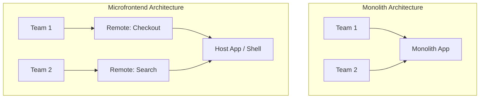
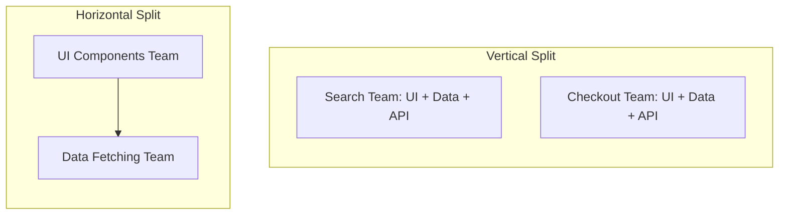
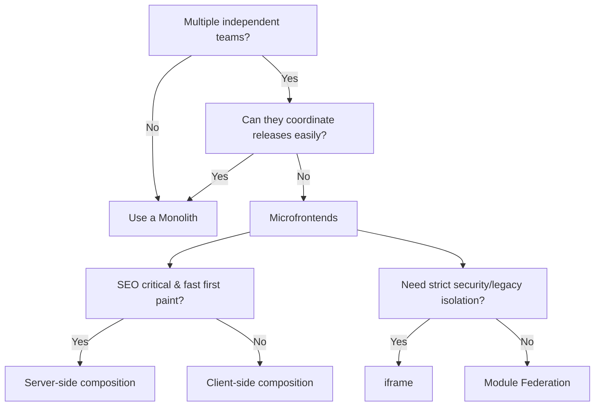

Microfrontends questions are showing up more often in senior and staff frontend system design rounds. The trap is treating the term as one idea. It is really a bundle of separate decisions: how teams own features, how code is deployed, where the page is composed, how shared dependencies are managed, and how much isolation each part needs. If you can separate those decisions, you sound like someone who has seen the operational cost, not just the architecture diagram.

> The mental model: a **frontend monolith** is one deployable app owned and shipped as a unit. A **microfrontend architecture** splits the product into independently owned frontend pieces that can be built, tested, deployed, and sometimes rolled back by different teams. The hard part is not "using Module Federation." The hard part is deciding where independence is worth the runtime, tooling, design-system, and governance cost.

## Quick Comparison

Before diving into the details, here is a high-level summary of the two architectures:

| Feature | Frontend Monolith | Microfrontends |
| :--- | :--- | :--- |
| **Deployment** | Single build and deployment | Independent deployments per team |
| **Codebase** | Single repository (usually) | Multiple repositories or a large monorepo |
| **Tech Stack** | Unified and consistent | Can be mixed (but highly discouraged for performance) |
| **Team Coordination** | High (blocking releases) | Low (autonomous releases) |
| **Complexity** | Low initially, grows with scale | High initially (tooling, routing, state) |

## The Core Distinction

Start with the deployable unit.



| Model                 | What ships                                        | Best when                                                                                                 |
| --------------------- | ------------------------------------------------- | --------------------------------------------------------------------------------------------------------- |
| **Frontend monolith** | One app, one build, one deploy pipeline           | One team or a few tightly coordinated teams, shared release cadence, strong UX consistency                |
| **Microfrontends**    | Multiple independently deployable frontend pieces | Many teams, separate roadmaps, high ownership boundaries, need to ship without coordinating every release |

A monolith is not automatically bad. For most products, it is the right starting point because it keeps the system simple: one router, one dependency graph, one design system version, one test setup, one observability surface, and one release. You pay less coordination overhead inside the codebase because everyone works in the same app.

Microfrontends buy team autonomy. A checkout team can deploy checkout without waiting for search. A billing team can own billing end to end. A marketplace page can be composed from independently shipped product, recommendations, and reviews surfaces. The trade-off is that the architecture now has to solve problems the monolith got for free: shared dependencies, cross-app routing, consistent styling, authentication context, observability, version compatibility, performance budgets, and failure isolation.

The senior answer is not "microfrontends scale better." It is: **microfrontends scale team ownership, but they add distributed-system problems to the frontend.**

## Vertical Split vs Horizontal Split

This is the ownership split. It is separate from the technology.

### Vertical split

A **vertical split** gives one team a full feature slice end to end: UI, state, data fetching, API contract, tests, monitoring, and release. For example:

- Search owns the search page, filters, results list, and search API contract.
- Checkout owns cart review, payment step, address validation, and checkout analytics.
- Account owns profile, settings, sessions, and security preferences.

This is usually the healthier microfrontend boundary because it mirrors product ownership. A team can reason about the user journey and make changes without asking another team to update the "shared page layer."

### Horizontal split

A **horizontal split** divides by technical or page layer: one team owns headers, another owns cards, another owns data access, another owns layouts. It can look clean on a diagram, but it often creates dependency chains for every product change. A simple user story crosses multiple teams.



Horizontal ownership can make sense for platform teams: a design system, shell, routing platform, observability SDK, experimentation framework, or shared authentication layer. But for product features, it often slows delivery because no team owns the full outcome.

> Interview phrasing: "I would prefer vertical splits around business capabilities, with a small platform layer for truly shared infrastructure. Horizontal splits are useful for platform primitives, but risky for product ownership because every feature becomes cross-team coordination."

## Client-Side vs Server-Side Composition

Composition answers the question: **where are the pieces stitched into one page?**

### Client-side composition

With client-side composition, the browser loads a host app first, then the host pulls in remote pieces at runtime. This is common with Module Federation-style architectures.

The upside is runtime flexibility. Teams can deploy remotes independently, and the host can decide which remote to load based on route, user, experiment, or feature flag. It also fits highly interactive app surfaces where SEO is less important.

The cost is first-load performance. The browser may need to download the shell, resolve remote manifests, fetch remote bundles, initialize shared dependencies, then render the real page. If you are not strict about bundle budgets and fallback states, you can turn one app into a waterfall of apps.

### Server-side composition

With server-side composition, the server or edge layer stitches the page before it reaches the browser. The user receives composed HTML earlier, which usually means faster first paint and better SEO. This model fits content-heavy, public, or commerce surfaces where the first screen matters.

The cost moves to infrastructure. You need a composition layer that can call or render each fragment, handle timeouts, cache aggressively, isolate failures, and preserve consistent request context. Server-side composition is not free; it moves complexity out of the browser and into the platform.

| Choice                      | Strength                                               | Watch out for                                                      |
| --------------------------- | ------------------------------------------------------ | ------------------------------------------------------------------ |
| **Client-side composition** | Independent runtime loading, flexible for app-like UIs | Bundle waterfalls, delayed first paint, SEO limits                 |
| **Server-side composition** | Faster first content, better SEO, cacheable shell      | More platform complexity, fragment timeouts, request orchestration |

For senior system design, connect this directly to the product. An internal dashboard behind login can tolerate client-side composition. A public product listing page probably needs server-side composition, static generation, or at least a server-rendered shell.

## Host vs Remote

In a microfrontend setup, the **host** is the shell app that orchestrates the page. It usually owns:

- top-level routing and navigation
- authentication/session context
- layout regions
- feature flag bootstrapping
- loading and error boundaries
- shared dependency configuration
- global observability hooks

A **remote** is an independently built and deployed piece that the host pulls in. A remote might be a full route, a page region, or a widget. It should own its internal UI, tests, data fetching, and release process.

The boundary has to be explicit. If the host reaches deep into a remote's internals, or a remote depends on undocumented host state, the architecture becomes a distributed monolith: many deployables, but no real independence.

A clean contract might look like this:

```tsx
type ProductReviewsRemoteProps = {
  productId: string;
  locale: string;
  user?: {
    id: string;
    isLoggedIn: boolean;
  };
  onReviewSubmitted?: (reviewId: string) => void;
};
```

That contract is small, typed, and product-oriented. It does not expose the host's store, router internals, or styling assumptions. The remote can evolve behind it.

## Module Federation vs iframe

This is the isolation decision. Both can power microfrontends, but they solve different problems.

### Module Federation

Module Federation lets a host load JavaScript modules from another build at runtime. The remote runs in the same DOM and JavaScript context as the host. That means it can feel native: shared routing, shared design system, shared dependencies, normal React component composition, and no iframe boundary.

The trade-off is weaker isolation. CSS can leak. Dependency versions can conflict. A remote can affect main-thread performance for the whole page. A runtime exception can break more than its own area unless you wrap it in error boundaries. Shared state can become tempting and then dangerous.

Use Module Federation when the product needs one cohesive app experience and teams can agree on platform contracts: React version, design system, routing conventions, analytics, accessibility rules, and performance budgets.

### iframe

An iframe gives hard isolation. The remote has its own document, CSS, JavaScript runtime, dependency graph, and security sandbox. It cannot accidentally leak styles into the host. This is useful for third-party embeds, untrusted code, legacy apps, payment widgets, admin tools, or areas with strict isolation requirements.

The cost is integration friction. Shared state is not natural; communication goes through `postMessage`. Styling and responsive layout are harder. Accessibility and focus management need extra care. Navigation, analytics, and auth often need bridging. The UI can feel less native.

| Option                | Best for                                                              | Main cost                                                         |
| --------------------- | --------------------------------------------------------------------- | ----------------------------------------------------------------- |
| **Module Federation** | First-party teams building one cohesive product                       | Shared runtime coupling and dependency governance                 |
| **iframe**            | Strong isolation, third-party or legacy surfaces, security boundaries | Harder state, styling, routing, accessibility, and UX integration |

The confident answer is not "iframes are old" or "Module Federation is modern." The answer is: **Module Federation optimizes integration; iframe optimizes isolation.**

## What Can Go Wrong

Microfrontends fail when teams split code but keep hidden coupling.

### Shared dependencies become a release bottleneck

If every remote must update together when React, the design system, or the analytics SDK changes, you have not gained much independence. Define which dependencies are shared, who owns them, which versions are allowed, and how upgrades are rolled out.

### Styling loses consistency

Independent teams can create five button variants, four spacing systems, and inconsistent loading states. A mature microfrontend setup needs a design system with tokens, accessible components, versioning, and clear contribution rules.

### Performance becomes everyone's problem and nobody's problem

Each remote might be "only 80 KB," but the composed page now loads six of them. Set page-level budgets, not just team-level budgets: JavaScript shipped, route-level LCP, INP, CLS, number of network requests, and remote load timeout behavior.

### Failure isolation is missing

If the recommendations remote fails, the product page should still render. Wrap remotes in loading, error, and timeout boundaries. Decide what fallback is acceptable: hide the section, show a skeleton, show cached data, or render a degraded local component.

```tsx
<RemoteBoundary
  name="reviews"
  fallback={<ReviewsSkeleton />}
  errorFallback={<ReviewsUnavailable />}
  timeoutMs={2500}
>
  <ProductReviews productId={product.id} locale={locale} />
</RemoteBoundary>
```

That kind of boundary is not decoration. It is the difference between independent deployment and one remote taking down the page.

### Observability stops at the shell

You need to know which remote caused an error, how long it took to load, which version was active, and whether a bad deployment affects one route or the whole app. Logs, metrics, traces, and frontend error reports should include remote name, version, route, user segment, and feature flag state.

## Real-World Examples

To ground the theory, consider how large organizations approach this:

- **E-commerce (e.g., IKEA, Amazon):** Heavily uses microfrontends. The search team, product details team, and checkout team can deploy independently. A bug in the product recommendation remote will not stop a user from completing a checkout.
- **Streaming Audio (e.g., Spotify's desktop app history):** Initially used microfrontends via iframes (and later other techniques) to allow separate teams to own the player, the playlist, and search, ensuring rapid feature iteration without breaking the core audio player.
- **SaaS Dashboard (e.g., a simple B2B analytics tool):** Typically stays a monolith. A small team builds it, and the user expects a highly cohesive, snappy single-page application experience with zero loading waterfalls.

## How To Answer In A System Design Interview

When asked "Would you use microfrontends?", do not answer with a tool. Walk through the decision.

### The Microfrontend Decision Tree



1. **Clarify the organization.** How many teams work on this frontend? Do they need separate release cadences? Are ownership boundaries stable?
2. **Clarify the product surface.** Is it public and SEO-sensitive, or an authenticated app? Is first paint critical? Are there legacy or third-party surfaces?
3. **Choose the split.** Prefer vertical business capability boundaries. Keep horizontal platform ownership limited and explicit.
4. **Choose composition.** Use server-side composition or a server-rendered shell when first paint and SEO matter; use client-side composition for app-like authenticated workflows where runtime flexibility matters more.
5. **Choose isolation.** Use Module Federation for cohesive first-party app experiences; use iframe when isolation, security, or legacy containment matters more than seamless integration.
6. **Name the platform contracts.** Design system, shared dependencies, routing, auth, analytics, error boundaries, versioning, testing, and rollback.
7. **State the trade-off.** Autonomy improves, but platform complexity and runtime risk increase.

A strong answer might sound like:

> "I would start with a monolith unless we have multiple teams blocked on independent release cycles. If we do split, I would split vertically by business capability: search, checkout, account. For a public SEO-sensitive product page, I would avoid a purely client-composed page and use server-side composition or a server-rendered shell. For first-party pieces that must feel native, Module Federation is reasonable, but I would enforce contracts around shared dependencies, design tokens, error boundaries, and observability. If the piece is third-party, legacy, or security-sensitive, I would use an iframe for isolation and accept the integration cost."

That answer shows judgment. It picks based on constraints, not hype.

## When NOT to use Microfrontends (Stick to a Monolith)

Choose a monolith (and avoid microfrontends) when:

- one team owns most of the app
- release coordination is not a bottleneck
- UX consistency matters more than team autonomy
- the product is still changing shape quickly
- the team lacks platform support for shared contracts and observability
- the microfrontend boundary would be smaller than the coordination overhead

A well-structured monolith can still have strong internal modularity: route-based ownership, package boundaries, feature folders, typed APIs, lazy-loaded routes, and CI checks. You do not need independent deploys to write maintainable frontend code.

In fact, a modular monolith is often the best intermediate step. Make boundaries clear inside one app first. If a boundary becomes organizationally painful, then extract it.

## When Microfrontends Are Worth It

Microfrontends become attractive when:

- many teams ship to the same product surface
- teams need independent deploy and rollback
- ownership maps cleanly to business capabilities
- legacy apps need to coexist during migration
- different product areas need different release cadences
- a platform team can own the host, contracts, tooling, observability, and design system

The platform team matters. Without platform ownership, every product team reinvents loading states, logging, dependency rules, and deployment conventions. Microfrontends are not just a frontend pattern; they are an operating model.

## Common Mistakes

- **Using microfrontends for code organization only** — if one team owns and deploys everything together, a modular monolith is simpler.
- **Splitting horizontally by UI layer** — product changes now cross teams, which undermines the autonomy you wanted.
- **Choosing Module Federation but ignoring runtime contracts** — shared dependencies, CSS, routing, and error boundaries need governance.
- **Client-composing an SEO-critical page** — you may delay meaningful HTML and hurt first paint. Consider server-side composition or a server-rendered shell.
- **Letting every remote own its own design language** — autonomy without design-system constraints becomes inconsistent UX.
- **No failure boundary per remote** — independent deployment is risky if one broken remote can blank the whole route.
- **No version visibility** — you cannot debug a distributed frontend if error reports do not identify the remote and version.

## FAQs

**Q: Do microfrontends improve performance?**
A: Rarely. They often degrade first-load performance due to multiple bundles and waterfalls. They optimize for *team velocity and autonomy*, not browser performance.

**Q: Can teams use different frameworks (e.g., React and Vue)?**
A: Technically yes, especially with iframes or web components. However, doing so in a single DOM often leads to bloated bundle sizes and inconsistent UX. It is usually an anti-pattern for product development, though sometimes necessary during a legacy migration.

**Q: Is Next.js a monolith or a microfrontend?**
A: Out of the box, Next.js is a monolith. However, features like Next.js Multi-Zones allow you to route different paths to independently deployed Next.js apps, effectively acting as a server-routed microfrontend architecture.

## Exercises

Try each before opening the answer.

### Exercise 1 — Marketplace product page

A public product page has product details, reviews, recommendations, and seller info. It must rank in search and show meaningful content fast. Would you use client-side or server-side composition?

<details>

<summary>Show answer</summary>

Prefer **server-side composition** or a server-rendered shell with streamed sections. The page is public and SEO-sensitive, so meaningful HTML should arrive early. Reviews or recommendations can still be independent fragments, but they need timeouts, caching, and fallbacks so a slow fragment does not block the core product content.

</details>

### Exercise 2 — Legacy admin tool

An old Angular admin panel must live inside a new React shell for six months. The teams do not need shared styling, but they need safe containment. Module Federation or iframe?

<details>

<summary>Show answer</summary>

Use an **iframe**. The goal is isolation and migration containment, not seamless shared state. Communicate through a narrow `postMessage` contract for auth/session events or navigation. Accept the UX integration cost because the boundary is temporary and safety matters more.

</details>

### Exercise 3 — Checkout owned by one team

Checkout has a stable team, its own roadmap, strict rollback needs, and changes more often than the rest of the storefront. Is this a good microfrontend boundary?

<details>

<summary>Show answer</summary>

Yes, it is a strong **vertical boundary**: one team owns a complete business capability with independent release and rollback needs. The contract should stay small: cart/session identifiers in, checkout events out. The host should provide layout, auth context, telemetry, and failure handling without reaching into checkout internals.

</details>

## The Mental Model To Keep

A frontend monolith is **one deployable app**. Microfrontends are **independently owned frontend pieces** that can be built, tested, shipped, and rolled back separately. Split **vertically** by business capability when you want real ownership; use **horizontal** ownership mainly for platform primitives. Compose **client-side** when runtime flexibility matters and SEO is secondary; compose **server-side** when first paint, SEO, and cacheable HTML matter. The **host** orchestrates the page; **remotes** own their feature internals. **Module Federation** gives shared modules in one DOM for cohesive first-party experiences; **iframe** gives hard isolation for third-party, legacy, or security-sensitive surfaces. The senior move is to start from team and product constraints, then choose the split, composition model, and isolation level that make the trade-off explicit.
